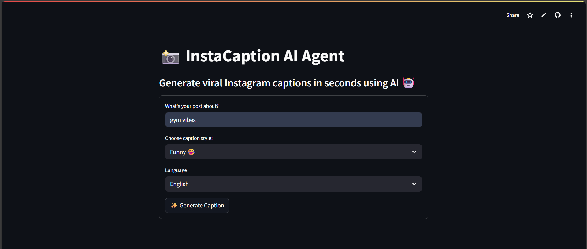
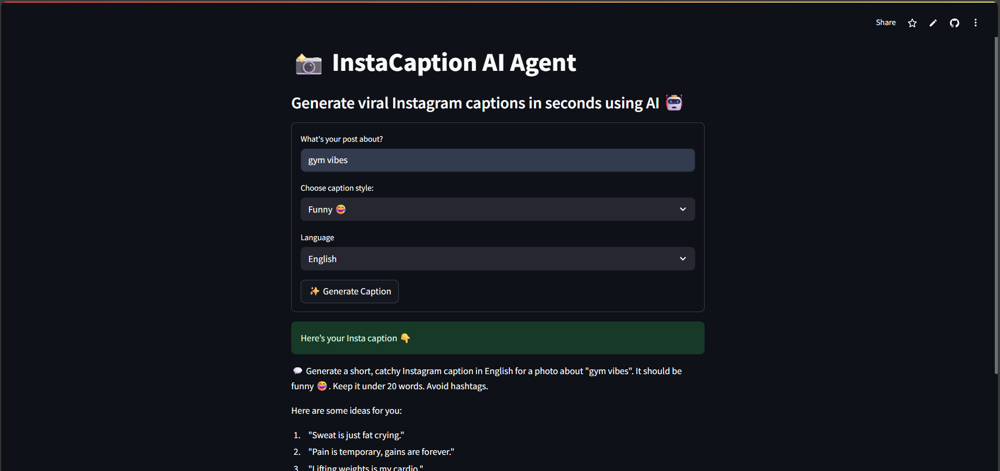

# 📸 InstaCaption AI Agent

> Generate viral Instagram captions in seconds using AI 🤖  
> Powered by Hugging Face models + Streamlit

---

## ✨ Live Demo

🎯 Try it here 👉 [text](https://instacaptionaiagent-g5wujiueqyq5ab63yrg8wg.streamlit.app/)

---

## 🧠 What It Does

InstaCaption AI is a simple, powerful tool that generates **short, creative Instagram captions** in seconds using natural language prompts.

Just tell the AI:
- What your post is about (e.g. *"gym vibes"*)
- Your caption **style** (funny, romantic, sarcastic, etc.)
- Preferred **language** (English, Hindi, Hinglish)

And get a list of **captions ready to copy** 📝

---

## 🚀 Features

✅ Multiple AI-generated caption options  
✅ Choose from 6 styles: Funny, Motivational, Romantic, Aesthetic, Sarcastic, Witty  
✅ Supports English, Hindi, and Hinglish  
✅ Built with free, open-source AI (no paid APIs!)  
✅ Fully deployed with Streamlit Cloud

---

## 🛠 Tech Stack

| Tech        | Role                            |
|-------------|---------------------------------|
| **Python** | Backend scripting & processing  |
| **Streamlit** | Interactive web UI            |
| **Hugging Face Transformers** | AI caption generation |
| **Google/flan-t5-large** or **Mixtral-8x7B** | Caption models |
| **dotenv** | Secure environment variable management |

---

## 🖼 Screenshots

| Input | Output |
|-------|--------|
|  |  |

> *(You can add these images in a `/screenshots/` folder and push them)*

---

## 🧩 Local Setup

To run locally:

```bash
git clone https://github.com/ajaz-ml/InstaCaption_AI_Agent.git
cd InstaCaption_AI_Agent
python -m venv venv
venv\Scripts\activate     # or source venv/bin/activate on Mac/Linux
pip install -r requirements.txt
